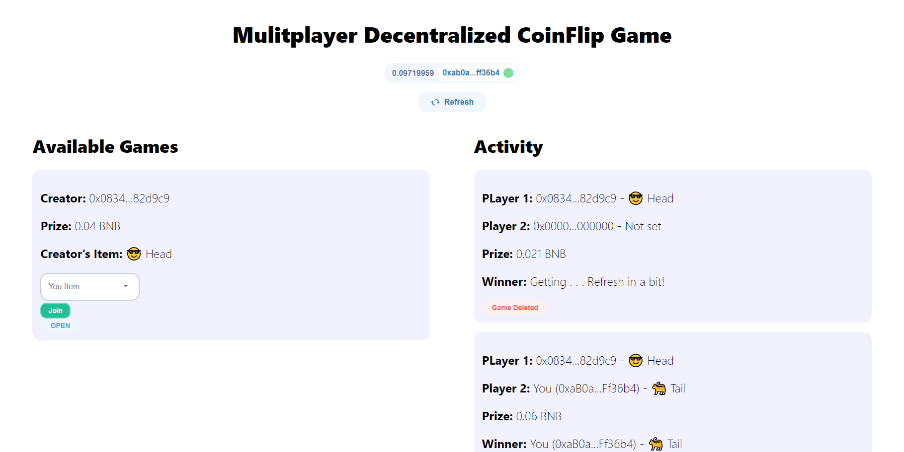

# Coin Flip

Coin Flip is a **decentralized multiplayer blockchain game**, in which users must bet more than $5 of testnet BNB to be able to play against each other. You can create your own game (you can set a bet as big as you want) and other people will be able to join the game you have created. Users can also join any available games created by other people. After the game is finished winner gets the prize. 

Please leave a ⭐ if you like it.

## Try It Out
You can try it out yourself in [live demo](https://projects.tijan.dev/coin-flip) on BNB testnet. You can get testnet BNB to be able to test it [here](https://testnet.binance.org/faucet-smart).

If you find any **errors** ⛔, please report them to [errors@tijan.dev](mailto:errors@tijan.dev) thanks 🙏.

## Technologies
Technologies used in this project:
- [Hardhat](https://hardhat.org/) for smart contracts
- [Chainlink](https://chain.link) for getting VRF to determine winner in decentralized maner
- [React](https://reactjs.org/)
- [Moralis](https://moralis.io/) for authentication
- [Web3UIKit](https://github.com/web3ui/web3uikit) for UI components

**UI source code is published [here](https://github.com/0xTijan/coin-flip).**

## About Me
Hi! 👋 I'm Tijan, passionate **blockchain developer** from Slovenia. Take a look at my [portfolio](https://tijan.dev).

You can get in touch with me through my [website](https://tijan.dev) or contact me on [twitter](https://twitter.com/0xTijan).

Do you like my work? You can support me by donating to this address: 0xC4C6A0bc6648a4F343bd86D7C48C9967530fbB48

## License
[MIT](https://choosealicense.com/licenses/mit/)